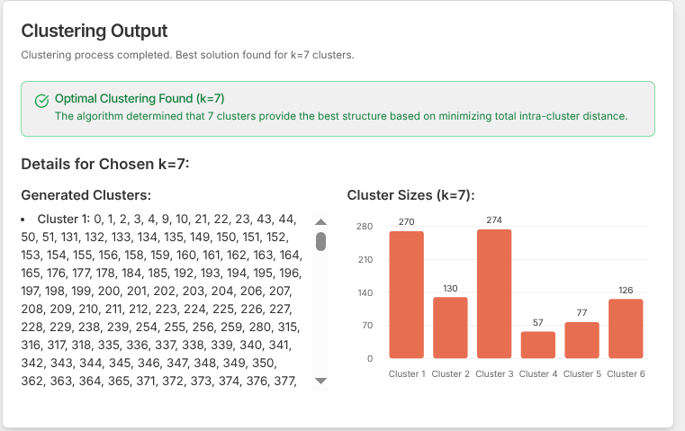

# 🚀 ClusterVision

**ClusterVision** is a tool for clustering data points based on a time-travel distance matrix, allowing you to experiment with different cluster sizes to achieve optimal metrics.

---

## 📂 Getting Started

- **Main Page:**  
  The application starts at [`src/app/page.tsx`](src/app/page.tsx).

- **Clustering Algorithm:**  
  Core logic is implemented in [`src/lib/actions.ts`](src/lib/actions.ts).

---

## ✨ Features

- **Data Upload:**  
  Upload a distance matrix in JSON format (`data/pairwise.json`), where each entry has `from`, `to`, and `distance` fields.  
  _Upload this to the "Distance Matrix File (.json)" input to run clustering._

- **Parameter Input:**  
  Set minimum and maximum number of clusters, and the minimum cluster size.

- **Clustering Algorithm:**  
  Uses a simulated K-Medoids algorithm (see below for details) to find the best clustering, respecting your constraints.

- **Cluster Display:**  
  Results are shown in a readable format, e.g.:  
  `Cluster 1: 4, 1, 9`  
  `Cluster 2: 0, 5, 8`  
  `Cluster 3: 2, 3, 6, 7`

- **Constraint Validation:**  
  If constraints are impossible to satisfy, the UI shows a warning and suggests parameter adjustments.

- **Map Visualization:**  
  To view results on a map, upload `data/locations.json` as the "Locations File (.json)".

---

## 🖼️ Workflow Overview

Below are the main steps of using ClusterVision, illustrated with screenshots:

### 1. Upload Data and Set Parameters

Upload your distance matrix and (optionally) locations file, then set clustering parameters.


---

### 2. Run Clustering and View Results

After running the clustering algorithm, view the optimal clusters and their members.



---

### 3. Compare Metrics for Different Cluster Counts

Visualize and compare the total intra-cluster distance and silhouette scores for all tested values of k.


---

### 4. Visualize Clusters on the Map

If you provided a locations file, you can display the clustered points on a map.


---

## 🧠 Algorithm Overview

The clustering is performed using a **simulated K-Medoids algorithm** with the following workflow:

1. **Input Parsing & Validation**
   - Reads the distance matrix and parameters.
   - Validates structure and logical consistency (e.g., enough points for requested clusters).

2. **Distance Map Preparation**
   - Converts the flat distance matrix into a nested map for efficient lookups.

3. **K-Medoids Simulation (for each k in range)**
   - Randomly selects `k` unique data points as initial medoids.
   - **Assignment Step:** Assigns each point to the nearest medoid.
   - **Update Step:** For each cluster, finds the member that minimizes the sum of distances to all other members (the new medoid).
   - Repeats assignment and update steps until convergence or max iterations.
   - Only clusters meeting the minimum size are considered valid.

4. **Metric Calculation**
   - For each k, computes:
     - **Total Intra-Cluster Distance:** Sum of distances from medoids to their cluster members.
     - **Silhouette Score:** Measures how well each point fits its cluster versus others (ranges from -1 to 1).

5. **Best K Selection**
   - Chooses the k with the lowest total intra-cluster distance among valid solutions.

6. **Output**
   - Returns the chosen clusters, chosen k, all metrics, and any warnings or errors.

---

## 📊 Example Distance Matrix Format

```json
[
  { "from": 1, "to": 2, "distance": 10 },
  { "from": 1, "to": 3, "distance": 5 },
  { "from": 2, "to": 3, "distance": 8 }
]
```

---

## 📖 Learn the Theory

A detailed, visually-rich **presentation** explaining the clustering theory, algorithm steps, and evaluation metrics is available at:

- [`docs/cluster-view.html`](docs/cluster-view.html)

Open this file in your browser for an interactive walkthrough of the clustering process and concepts.

---

## 📝 Notes

- If you see warnings about constraints, try adjusting the minimum cluster size or the cluster count range.
- The clustering algorithm is robust to outliers and works with real-world (non-Euclidean) distance metrics.

---